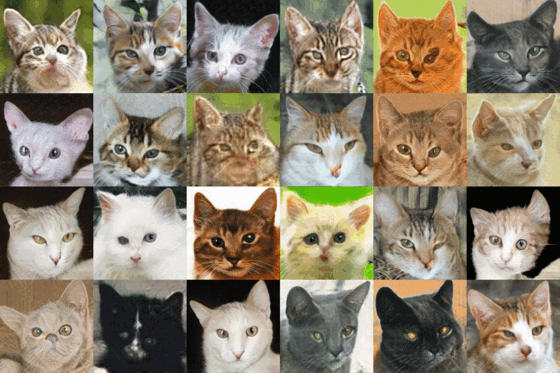

 # Faster Projected GAN

Unofficial PyTorch implementation of Faster Projected GAN introduced in the paper [Faster Projected GAN: Towards Faster
Few-Shot Image Generation](https://arxiv.org/abs/2403.08778v1).

Results on the AnimalFace-cat dataset (160 images, provided by FastGAN authors) after training for less than 237 kimg:

<br>

<div align='center'>
 
</div>

<br>

## Introduction
A deep learning model designed for few-shot image generation. It trains rapidly and yields high-quality images, even with a limited dataset (e.g., fewer than 100 samples).

## Installation
1. Clone repo

    ```bash
    git clone https://github.com/diarimandimby/Faster-Projected-GAN/
    cd Faster-Projected-GAN
    ```

2. Install requirements

   ```bash
   pip install -r requirements.txt
   ```

## Usage

### Integrating into your project
You can easily import and initialize the generator and discriminator in your own Python scripts:

```python
from generator import FasterProjectedGANGenerator
from discriminator import ProjectedGANDiscriminator

# Initialize models
G = FasterProjectedGANGenerator()
D = ProjectedGANDiscriminator()
```

### Quick Start
If you want to use the model without installing anything locally, you can also try our [Colab notebook](https://colab.research.google.com/drive/1szFFNKWGomsLt4-95aFGVxg8suv4J7jK).

## Citation
```bibtex
@misc{liu2021fasterstabilizedgantraining,
      title={Towards Faster and Stabilized GAN Training for High-fidelity Few-shot Image Synthesis}, 
      author={Bingchen Liu and Yizhe Zhu and Kunpeng Song and Ahmed Elgammal},
      year={2021},
      eprint={2101.04775},
      archivePrefix={arXiv},
      primaryClass={cs.CV},
      url={https://arxiv.org/abs/2101.04775}, 
}
```
```bibtex
@InProceedings{Sauer2021NEURIPS,
  author         = {Axel Sauer and Kashyap Chitta and Jens M{\"{u}}ller and Andreas Geiger},
  title          = {Projected GANs Converge Faster},
  booktitle      = {Advances in Neural Information Processing Systems (NeurIPS)},
  year           = {2021},
}
```
```bibtex
@misc{wang2024fasterprojectedganfaster,
      title              = {Faster Projected GAN: Towards Faster Few-Shot Image Generation}, 
      author             = {Chuang Wang and Zhengping Li and Yuwen Hao and Lijun Wang and Xiaoxue Li},
      year               = {2024},
      eprint             = {2403.08778},
      archivePrefix      = {arXiv},
      primaryClass       = {cs.CV},
      url                = {https://arxiv.org/abs/2403.08778}, 
}
```
## Contributing

Contributions are welcome! If you want to improve this implementation, fix a bug, or add new features, feel free to open an issue or submit a pull request.

---

If this repo is helpful, please help to ⭐ it or recommend it to your friends 😊.
